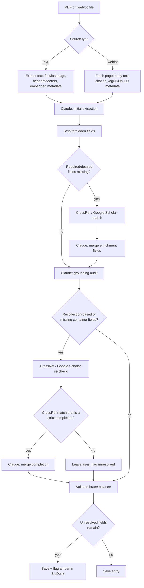

# Notes

Reasoning, measurements and the developer tooling. Nothing here is needed in order
to use the agent; see [`README.md`](README.md) for that.

- [The cached prefix](#the-cached-prefix)
- [How the cost arises](#how-the-cost-arises)
- [The orchestration](#the-orchestration)
- [Auto-filing: what was measured](#auto-filing-what-was-measured)
- [Developer tooling](#developer-tooling)
- [Third-party material](#third-party-material)

## The cached prefix

Five files are assembled into a static prefix and cached with the provider, so that
a run pays for them once and reads them back thereafter.

| component | tokens |
| --- | ---: |
| `notes-test.bib` — the package's annotated test suite | 46,302 |
| `CLAUDE.md` — house style | 11,508 |
| `biblatex-chicago-notes-ref.md` — condensed field reference | 4,959 |
| `cms-notes-intro-guide.md` — entry types by kind of source | 3,208 |
| `biblio-template.bib` — one worked example per type | 2,242 |

**68,928 tokens in total** (232,976 characters) on 2026-08-07, measured by
`dev/estimate_cost.py --no-api`, which applies the project's own ratio of 3.38
characters per token. Dropping `--no-api` counts exactly through the API's
`count_tokens`, which requires credit.

Only `CLAUDE.md` moves in ordinary use — the other four are vendored or generated —
so it is the file to suspect when the figure shifts.

The two corpora loaded by `example_files` do different work from the field
reference. Where the reference teaches *vocabulary* — which fields a given type
takes — they teach *classification*: what kind of thing a source is, and which of
the forty types therefore fits. `notes-test.bib` carries an `annote` on nearly every
entry explaining why that type and that field set follow from the source;
`cms-notes-intro-guide.md` is organised by kind of source rather than by type, which
is what makes it usable before the type is known.

**Precedence divides by question, not by file.** The package's own files are
authoritative on what biblatex-chicago supports — which types exist, what each
field does, what reaches the printed page. `CLAUDE.md` and `biblio-template.bib` are
authoritative on this project's presentation choices, where the package permits more
than one form. Neither local file can overrule the package on a question of
capability, and the operational test when the two are confused is to encode both
alternatives and compare the rendered output. `CLAUDE.md` sets this out at length.

To shorten the prefix, `notes-test.bib` is the obvious candidate at 46,302 of the
68,928 tokens: dropping it from `example_files` while retaining
`cms-notes-intro-guide.md` leaves roughly 22,600 and a much cheaper first file,
preserving the taxonomy while shedding the annotated examples. Weigh that against
what the suite is for — it is the authority on what each type and field actually
does.

`biblatex-chicago-fields.md` reproduces §4.2 of the manual and is deliberately *not*
loaded: an A/B run found no benefit for some 45,000 additional tokens. It remains
for consultation.

## How the cost arises

The figures are in [`README.md`](README.md); this is the mechanism behind them. A
cache write costs 1.25× the input rate at the five-minute TTL and 2× at one hour; a
read costs 0.1×. Since the prefix is written once per run and read by every
subsequent call, the dominant variable is not the number of files but the number of
*cold starts* — which is why ten single-file invocations across an hour cost four
times what one batch of ten costs at the same TTL.

`dev/estimate_cost.py` holds the per-model rate table, and it is the one thing in
this repository that has to be maintained by hand: there is no pricing API to read
it from.

## The orchestration

`biblio_agent.py`'s control flow, for anyone modifying it. The branching belongs to
the harness around the model calls, not to the extraction itself — the bibliographic
judgment happens inside the four Claude calls, and the diamonds below only decide
which of them run.

## Auto-filing: what was measured

With `autofile_bibdesk: true`, `_save_via_bibdesk` calls BibDesk's `auto file` with
no destination, leaving BibDesk to generate the filename from its Local File format.
Its TeX stripping is what produces the damage rather than what prevents it: the
backslash, the command name and the braces are deleted and every brace group's
contents kept, which is right for a one-argument formatting command and wrong for
the two shapes a Chicago library uses constantly.

| in the entry | filed as | |
| --- | --- | --- |
| `\mkbibemph{X}` | `X` | correct |
| `\bibstring{reviewof}` | `reviewof` | the argument is a keyword |
| `\foreignlanguage{russian}{X}` | `russianX` | the first argument is a parameter |

`~`, `\,`, `---` and `--` are not `\word`-shaped, so nothing touches them at all. In
one library roughly one attachment in seven arrived damaged.

All sixteen values of `BDSKLocalFileCleanOptionKey` were measured: none removes the
debris, and value 4 transliterates Cyrillic. The format string makes no difference
either — `%T10`, `%t0` and `%f{Title}` render identically. The only remedy is a
`Did Auto File` script hook rewriting the name after BibDesk has chosen it, which is
configuration of BibDesk rather than of this agent, and so lives outside this
repository.

## Developer tooling

Nothing in `dev/` runs during extraction.

| | |
| --- | --- |
| `test_setup.py` | Dependencies, configuration, context files, OCR, and documentation drift. `--preflight` is the fast subset the quick action runs. |
| `install_service.py` | Builds the Automator workflow from `automator/script.sh` and installs it. |
| `estimate_cost.py` | Measures the current prefix and prices it, per model. |
| `ab_compare.py` | Scores two extraction runs against curated ground truth. |

Context generators, to be re-run after a package update and then diffed:

| | |
| --- | --- |
| `extract_intro.py` | Regenerates `cms-notes-intro-guide.md` from the package's `cms-notes-intro.tex`. |
| `extract_manual.py` | Regenerates `biblatex-chicago-fields.md` from `biblatex-chicago.tex`. |
| `build_template.py` | Regenerates `biblio-template.bib` from real entries, stripping BibDesk bookkeeping. |

Normalization of an existing library, documented in
[`dev/normalization-plan.md`](dev/normalization-plan.md):

| tool | acts by | for |
| --- | --- | --- |
| `bib_audit.py` | — (read-only) | Counting. Parses by byte span and proves round-trip equality before reporting anything. Also holds the predicates the other two import. |
| `bib_normalize.py` | rule | Edits derived from a predicate that fires across the corpus. |
| `bib_apply.py` | name | A JSON list of “in entry X, set field Y to Z”, for what judgement rather than rule must settle. |
| `bib_bisect.py` | subsetting | Isolates the entry that breaks a build or crashes BibDesk. |

Three properties make these safe against an irreplaceable file. **Nothing is
re-serialized**: every change is a byte-span rewrite, so tab indentation,
alphabetical field order, the multi-kilobyte base64 in `bdsk-file-*` and the
`@comment` blocks holding the group hierarchy all pass through untouched — and,
decisively, the diff remains reviewable. **Ten gates** run before any write:
round-trip, entry count, citekey order, `@comment` byte-identity, protected fields,
swallowed fields, doubled commas, length arithmetic computed independently of the
scanner, utf-8 identity, and an independent `bibtool` parse. **Anything doubtful is
left alone and reported** rather than transformed.

The defect class worth knowing about is the one nobody plans for: values that are
well-formed and wrong — a page range sitting in `Volume`, a bare number in
`Issuetitle`, a title stored twice. They parse, they compile, and they read as
merely odd records.

## Third-party material

| File | Origin | Modified |
| --- | --- | --- |
| `notes-test.bib` | the package's `doc/` directory | yes — LaTeX accent macros converted to Unicode, double-hyphen ranges to single hyphens; no bibliographic content altered |
| `cms-notes-intro-guide.md` | derived from `cms-notes-intro.tex` by `dev/extract_intro.py` | yes — LaTeX scaffolding stripped, cross-references rendered as plain text; wording unchanged |
| `biblatex-chicago-fields.md` | derived from §4.2 of `biblatex-chicago.tex` by `dev/extract_manual.py` | yes — markup stripped, paragraphs reflowed, one heading added per field; wording unchanged |

The two `.tex` sources are not vendored: they ship with the package, and what this
project consumes is the generated file. Upstream drift therefore surfaces as a diff
in the generated file when the script is re-run, which is the artefact that matters.
