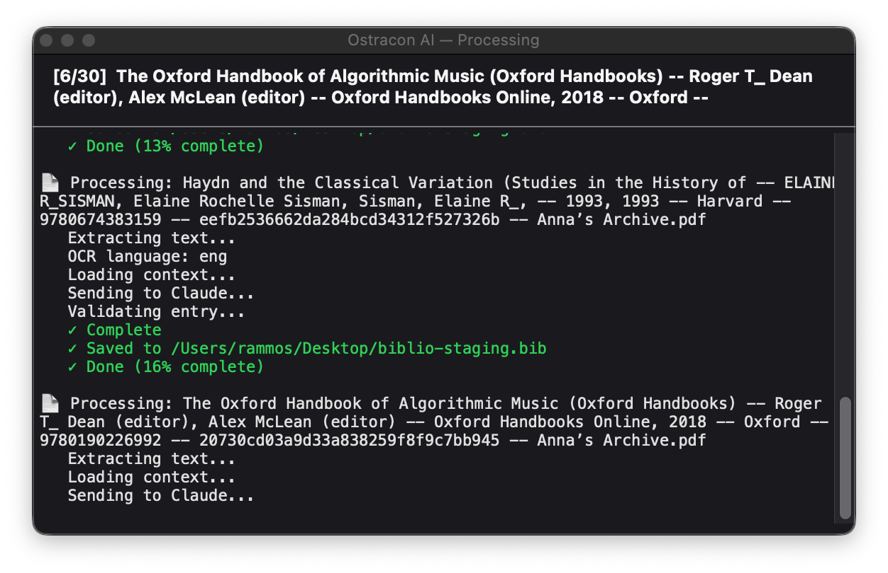

# BibLaTeX-Chicago-Claude (a.k.a. “Ostracon”)

A Claude-powered macOS tool for extracting bibliographic information from academic PDF files and generating BibLaTeX-Chicago entries in notes-and-bibliography style.

## Rationale

[Chicago](https://www.chicagomanualofstyle.org/tools_citationguide/citation-guide-1.html) is the venerable bibliography style typically used in the humanities, celebrated for its attention to source and transmission history, various types of authorship, and detail in general. The notes-and-bibliography variant, in particular, relies on footnotes or endnotes rather than inline references, and is the more common one in music theory and musicology.

Given the immense number of types and fields stipulated in the [BibLaTeX-Chicago](https://ch.mirrors.cicku.me/ctan/macros/latex/contrib/biblatex-contrib/biblatex-chicago/doc/biblatex-chicago.pdf) package, Zotero is hardly a viable bibliography manager for users of the style. On macOS, BibDesk is the only bibliography manager that elegantly negotiates this ontological complexity. Other writers avoid bibliography managers altogether and prefer to edit `.bib` files directly using a text editor.

In either case, this tool aims to enhance BibDesk-based workflows with Zotero-like auto-fill capabilities for new bibliography entries. Thanks to its reliance on AI, prompted here with a mini-corpus of example bibliographic entries and a summary of BibLaTeX-Chicago’s specifications, this tool should not just match but actually outperform Zotero’s auto-fill performance in most cases.

Using alternative styles (e.g., APA) would involve only minor modifications to the prompts and context; it is left as a trivial exercise for the reader.

## Functionality

1. Takes one or more PDF files as input.
2. Extracts text from the first page (~450 words) and last ~150 words.
3. Automatically runs OCR if the PDF appears to be scanned.
4. Sends the extracted text to the Claude API with project guidelines and a reference template.
5. Returns a properly formatted BibLaTeX-Chicago entry.
6. Validates brace balance before saving.
7. Saves the entry — with a BibDesk `bdsk-file-1` bookmark — either directly into BibDesk (if `autofile_bibdesk` is enabled) or to the staging file (`main_bib_file` in `config.yaml`).
8. On validation failure, saves the raw entry to `failed_bib_file` and sends a macOS notification.

With `autofile_bibdesk` disabled, the staging file can be periodically imported into BibDesk; PDF links will already be intact thanks to the embedded bookmark.



## Setup

### 1. Install system dependencies

```bash
# OCR support (optional but recommended for scanned PDFs)
brew install ocrmypdf
```

### 2. Create a Python environment and install dependencies

```bash
conda create -n biblio-ai python=3.11   # or use venv
conda activate biblio-ai
pip install -r requirements.txt
```

`requirements.txt` includes:

- `anthropic` — Claude API client.
- `pypdf` — PDF text extraction.
- `pyyaml` — configuration.
- `pyobjc-framework-Cocoa` — macOS file bookmarks for BibDesk integration.

### 3. Configure

Edit `config.yaml`:

```yaml
anthropic_api_key: "sk-ant-..." # your Anthropic API key
main_bib_file: "~/Desktop/biblio-staging.bib" # staging output
failed_bib_file: "~/Desktop/biblio-failed.bib" # validation failures
```

The other paths (`pdf_in_folder`, `pdf_out_folder`, `template_file`, `claude_md_file`) can be left untouched or adjusted to your setup. The optional `ref_file` key (set to `biblatex-chicago-notes-ref.md` by default) loads a condensed biblatex-chicago field reference into the Claude prompt to improve extraction quality; remove or comment it out to omit it.

### 4. Customize the extraction prompt

Edit `CLAUDE.md` to match your bibliographic conventions. At minimum, review:

- The output format and field exclusions (e.g. which fields to omit).
- Title-case rules for any languages you work with.
- Any domain-specific entry types or fields you rely on.

The richer and more specific your `CLAUDE.md`, the more accurately Claude will format entries to your standards.

### 5. Configure the Automator script

```bash
cp automator/script.sh.example automator/script.sh
```

Edit `automator/script.sh` and set `PYTHON` to the path of your Python executable and `WORKDIR` to the absolute path of this repository. This file is excluded from version control.

### 6. Install the macOS quick action

```bash
python3 install_service.py
```

This builds the Automator workflow from `automator/script.sh` and installs it to `~/Library/Services/`. Re-run it any time you modify `script.sh`.

## Usage

### macOS quick action (recommended)

Right-click any PDF (or selection of PDFs) in Finder and choose **Extract BibLaTeX-Chicago Bibliography (via Claude)**. The entry is appended to the staging file and copied to the clipboard.

See [Setup](#5-configure-the-automator-script) for initial configuration. To reinstall after changes to `automator/script.sh`:

```bash
python3 install_service.py
```

### Command line

```bash
# Process one or more PDFs
python biblio_agent.py path/to/paper.pdf

# Process without saving (print to stdout only)
python biblio_agent.py path/to/paper.pdf --no-save

# Process all PDFs in pdf-in/ and move them to pdf-out/
python biblio_agent.py --all

# Write to a custom output file
python biblio_agent.py path/to/paper.pdf --output custom.bib
```

## File structure

```
ostracon-ai/
├── biblio_agent.py       # Main orchestrator
├── extract_pages.py      # PDF text extraction with OCR fallback
├── install_service.py    # Builds and installs the macOS Quick Action
├── config.yaml           # Configuration (API key, paths, model)
├── requirements.txt      # Python dependencies
├── CLAUDE.md             # Bibliographic extraction guidelines for Claude
├── biblio-template.bib   # Reference template for BibLaTeX-Chicago types/fields
├── biblatex-chicago-notes-ref.md  # Condensed biblatex-chicago field reference (sent to Claude)
├── automator/
│   ├── script.sh.example # Shell script template (copy to script.sh and edit)
│   └── script.sh         # Your local script (gitignored — machine-specific paths)
├── pdf-in/               # Drop PDFs here for batch processing (--all)
└── pdf-out/              # Processed PDFs are moved here
```

## BibDesk integration

By default the tool writes to the file set in `main_bib_file` (`config.yaml`), which you import into BibDesk manually. Each entry includes a `bdsk-file-1` bookmark so PDF links resolve correctly after import.

Set `autofile_bibdesk: true` in `config.yaml` to skip the staging file entirely. The tool will import each entry directly into BibDesk via AppleScript (opening the staging file in BibDesk if it is not already open) and immediately trigger BibDesk’s auto-file to move the PDF to your papers folder.

## Troubleshooting

**Entry saved to `failed_bib_file` instead of staging file**
The generated entry had unbalanced braces. Open the failed file, fix the entry manually, and add it to the staging file.

**`bdsk-file-1` bookmark not working after import**
Make sure `pyobjc-framework-Cocoa` is installed in the Python environment used by the Quick Action (check the `PYTHON` path in `automator/script.sh`).

**Quick Action not appearing in Finder**
Run `python3 install_service.py` and check System Settings → General → Login Items & Extensions to confirm the action is enabled.

**OCR not working**
Install `ocrmypdf` via Homebrew. The tool will fall back to direct text extraction if OCR is unavailable. When a scanned PDF is detected, a language selection dialog will appear — pick the language of the document so Tesseract uses the correct model. In quiet/automation mode, the language defaults to `eng`; set `default_ocr_language` in `config.yaml` to override (e.g. `rus`, `deu`, `fra`).

## Cost estimate

Using Claude Sonnet:

- ~$0.02–$0.03 per PDF.

## “Ostracon”?

> An ostracon (Greek: ὄστρακον ostrakon, plural ὄστρακα ostraka) is a piece of pottery (or stone), usually broken off from a vase or other earthenware vessel. In archaeology, ostraca may contain scratched-in words or other forms of writing which may give clues as to the time when the piece was in use.

## License

Copyright (c) 2026 [yrammos](https://github.com/yrammos). Licensed under [CC BY-NC 4.0](https://creativecommons.org/licenses/by-nc/4.0/). Free for personal use; attribution required for forks and modifications; commercial use prohibited.
