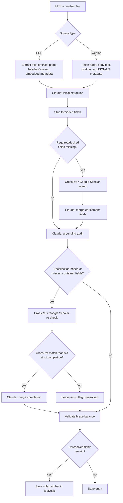

# Ostracon

A Claude-powered macOS agent for generating BibLaTeX-Chicago entries from PDF files and `.webloc` bookmarks to online-only publications.

- [Quick Start](#quick-start)
- [Rationale](#rationale)
- [Functionality](#functionality)
  - [Extraction and Reconciliation Flow](#extraction-and-reconciliation-flow)
- [Setup](#setup)
  - [1. Install System Dependencies](#1-install-system-dependencies)
  - [2. Create a Python Environment and Install Dependencies](#2-create-a-python-environment-and-install-dependencies)
  - [3. Configure](#3-configure)
  - [4. Customize the Extraction Prompt](#4-customize-the-extraction-prompt)
  - [5. Configure the Automator Script](#5-configure-the-automator-script)
  - [6. Install the macOS Quick Action](#6-install-the-macos-quick-action)
  - [7. Verify the setup](#7-verify-the-setup)
- [Usage](#usage)
  - [macOS Quick Action (Recommended)](#macos-quick-action-recommended)
  - [Command Line](#command-line)
- [Project Structure](#project-structure)
- [Normalizing a legacy library](#normalizing-a-legacy-library)
- [BibDesk Integration](#bibdesk-integration)
- [Troubleshooting](#troubleshooting)
- [Cost Estimate](#cost-estimate)
  - [Batching and cache TTL](#batching-and-cache-ttl)
- [Why "Ostracon"?](#why-ostracon)
- [License](#license)
  - [Third-party material](#third-party-material)

## Quick Start

```bash
brew install ocrmypdf                   # OCR support (optional)
pip install -r requirements.txt         # Python dependencies
cp config.yaml.example config.yaml     # then set anthropic_api_key within
cp automator/script.sh.example automator/script.sh  # then edit PYTHON and WORKDIR within
python3 dev/install_service.py          # install the Finder quick action (optional, recommended)
```

Then right-click any PDF or `.webloc` file in Finder and choose **Extract BibLaTeX-Chicago Bibliography (via Claude)**. See [Setup](#setup) for full configuration details.

## Rationale

[Chicago](https://www.chicagomanualofstyle.org/tools_citationguide/citation-guide-1.html) is the bibliography style typically used in the humanities, cherished for its attention to source and transmission details.

The immense number of types and fields in the [BibLaTeX-Chicago](https://ch.mirrors.cicku.me/ctan/macros/latex/contrib/biblatex-contrib/biblatex-chicago/doc/biblatex-chicago.pdf) package makes Zotero-like auto-creation and auto-fill harder to reproduce reliably by hand.

With or without BibDesk, this agent enhances BibLaTeX-Chicago writing workflows by providing Zotero-like auto-creation and auto-fill capabilities for new bibliographic materials, whether in the form of PDFs or online-only sources.

Using alternative styles (e.g., APA) would involve only minor modifications to the prompts and context; it is left as a trivial exercise for the reader.

## Functionality

1. Accepts one or more PDF and/or `.webloc` files as input.
2. For a PDF: runs OCR if necessary, after prompting the user to select the text language, then extracts text from the first page (~450 words), the last page (~150 words), running headers/footers from each page, and embedded metadata.
3. Sends all of the above to the Claude API together with the cached context prefix — the house-style guidelines, the entry-type template, the field reference, and the worked-example corpora — and asks Claude to generate a BibLaTeX-Chicago entry.
4. Strips any field the guidelines forbid (ISSN, ISBN, keywords, or a redundant `Url`) that Claude included anyway. A structural safeguard, because the prompt can be overgenerous. The `Url` rule is **one canonical locator per entry**: Chicago cites a DOI in preference to a URL, so a `Url` beside a `Doi` goes, while an entry with no DOI keeps its `Url` whatever its type — there the address is the only locator the style has to print.
5. If required or desired fields for the entry type are still missing, searches CrossRef and, as a fallback, Google Scholar (via ScrapingDog) for the work, then merges any fields found via a second Claude pass.
6. Audits the entry for fields filled from Claude's training-data recollection rather than the source text—a genuine failure mode with academic works Claude may recognize.
7. Re-checks CrossRef/Scholar for recollection-based or missing container-level fields (editor, publisher, date). A conflicting value is applied automatically only when it comes from CrossRef and strictly completes the entry.
8. Validates brace balance before saving.
9. Saves the entry—with a BibDesk `bdsk-file` bookmark to the source PDF or `.webloc` file—either directly into BibDesk (if `autofile_bibdesk` is enabled) or to the staging file (`main_bib_file`) for later import.
10. On validation failure, saves the raw entry to `failed_bib_file` and sends a macOS notification.

With `autofile_bibdesk` disabled, the staging file can be periodically imported into BibDesk; source links will already be intact thanks to the embedded bookmark.

### Extraction and Reconciliation Flow


```mermaid
flowchart TD
    A[PDF or .webloc file] --> B{Source type}
    B -- PDF --> C1[Extract text: first/last page,<br/>headers/footers, embedded metadata]
    B -- .webloc --> C2[Fetch page: body text,<br/>citation_/og/JSON-LD metadata]
    C1 --> D[Claude: initial extraction]
    C2 --> D
    D --> E[Strip forbidden fields]
    E --> F{Required/desired<br/>fields missing?}
    F -- yes --> G[CrossRef / Google Scholar search]
    G --> H[Claude: merge enrichment fields]
    F -- no --> I[Claude: grounding audit]
    H --> I
    I --> J{Recollection-based or<br/>missing container fields?}
    J -- yes --> K[CrossRef / Google Scholar re-check]
    K --> L{CrossRef match that is a<br/>strict completion?}
    L -- yes --> M[Claude: merge completion]
    L -- no --> N[Leave as-is, flag unresolved]
    M --> O[Validate brace balance]
    N --> O
    J -- no --> O
    O --> P{Unresolved fields<br/>remain?}
    P -- yes --> Q[Save + flag amber in BibDesk]
    P -- no --> R[Save entry]
```


## Setup

### 1. Install System Dependencies

```bash
# OCR support (optional but recommended for scanned PDFs)
brew install ocrmypdf
```

### 2. Create a Python Environment and Install Dependencies

```bash
conda create -n biblio-ai python=3.11   # or use venv
conda activate biblio-ai
pip install -r requirements.txt
```

`requirements.txt` includes:

- `anthropic`—Claude API client.
- `pypdf`—PDF text extraction.
- `pyyaml`—configuration.
- `pyobjc-framework-Cocoa`—macOS file bookmarks for BibDesk integration.
- `requests`—fetching `.webloc`-bookmarked pages.
- `beautifulsoup4`—parsing fetched pages for text and metadata.

### 3. Configure

Edit `config.yaml`:

```yaml
anthropic_api_key: "sk-ant-..." # your Anthropic API key
main_bib_file: "~/Desktop/biblio-staging.bib" # output file ("staging output")
failed_bib_file: "~/Desktop/biblio-failed.bib" # error file
```

The other paths (`pdf_in_folder`, `pdf_out_folder`, `template_file`, `claude_md_file`) can be left untouched or adjusted to your setup. The optional `ref_file` key (set to `prompt-context/biblatex-chicago-notes-ref.md`) loads the condensed reference.

The optional `example_files` key loads two worked-example corpora from the biblatex-chicago package's own documentation:

- `notes-test.bib` — the package's annotated test suite (203 entries, 32 of the ~40 entry types), where nearly every entry's `annote` explains _why_ that type and those fields were chosen. Converted to Unicode and normalized for this project.
- `cms-notes-intro-guide.md` — prose grouping entry types by kind of source, derived by `dev/extract_intro.py` from `cms-notes-intro.tex`, which ships with the package rather than being vendored here. Bracketed names point at examples in `notes-test.bib`.

Where the field reference teaches _vocabulary_ (which fields a type takes), these teach _classification_ — what kind of thing a source is, and which type therefore fits. They add ~49,000 tokens to the prompt prefix.

Precedence splits by question, not by file: the corpora are authoritative on what biblatex-chicago supports, `CLAUDE.md` and `biblio-template.bib` on this project's presentation choices. Neither local file can override the package's supported types or fields.

#### External lookup services (optional)

When a source doesn't yield every field the entry type needs, the agent queries external catalogues. Both keys are optional and the pipeline runs without them — it simply flags what it couldn't fill.

```yaml
crossref_email: "you@example.com" # optional; enables CrossRef's faster "polite pool"
scrapingdog_api_key: "" # optional; enables the Google Scholar fallback
```

- **CrossRef** is free and needs no account. Supplying `crossref_email` opts you into the [polite pool](https://api.crossref.org), which is faster and more reliable than the anonymous one; the address should be one monitored by the maintainer.
- **Google Scholar** has no public API, so the fallback goes through [ScrapingDog](https://scrapingdog.com), which is paid — roughly $0.0004/credit on pay-as-you-go ($10 for 25,000 credits), a couple of credits per lookup.

#### Other options

| Key                     | Default             | Effect                                                                                                                                                                                                               |
| ----------------------- | ------------------- | -------------------------------------------------------------------------------------------------------------------------------------------------------------------------------------------------------------------- |
| `model`                 | `claude-sonnet-4-6` | Claude model. Run `dev/estimate_cost.py --model <id>` to price alternatives first.                                                                                                                                   |
| `max_tokens`            | `4000`              | Ceiling on each response. Entries run 400–500 tokens; the headroom absorbs longer ones.                                                                                                                              |
| `cache_ttl`             | `"1h"`              | Prompt-cache lifetime. See [Cost Estimate](#cost-estimate).                                                                                                                                                          |
| `enrich_missing_fields` | `true`              | Enables the CrossRef/Scholar lookups, the grounding audit, and reconciliation. Setting it `false` leaves only the initial extraction — cheaper and faster, but no enrichment or review of recollection-based fields. |
| `verbose`               | `true`              | Progress messages on stderr.                                                                                                                                                                                         |
| `show_window`           | `false`             | Show the floating progress window by default (`--window`/`--no-window` override it).                                                                                                                                 |
| `window_models`         | sonnet-4-6, opus-5  | Models offered in the progress window's dropdown — see [Quick Action](#macos-quick-action-recommended). Unset hides the dropdown.                                                                                    |
| `window_start_delay`    | `4`                 | Seconds the window waits before the first file so the model can be changed; `0` starts immediately.                                                                                                                  |
| `notifications`         | `false`             | macOS notifications for batch progress and validation failures.                                                                                                                                                      |
| `ocr_threshold`         | `100`               | Words below which a PDF is treated as scanned and sent to OCR.                                                                                                                                                       |
| `ocr_timeout`           | `180`               | Seconds allowed for `ocrmypdf` before giving up.                                                                                                                                                                     |
| `default_ocr_language`  | `eng`               | Tesseract language used when OCR runs non-interactively.                                                                                                                                                             |

### 4. Customize the Extraction Prompt

Edit `CLAUDE.md` to match your bibliographic conventions. At minimum, review:

- The output format and field exclusions (e.g. which fields to omit), including the `@Online`/undated-entry exception that allows `Url`/`Urldate`.
- Title-case rules for any languages you work with.
- Any domain-specific entry types or fields you rely on.

The richer and more specific your `CLAUDE.md`, the more accurately Claude will format entries to your standards.

### 5. Configure the Automator Script

```bash
cp automator/script.sh.example automator/script.sh
```

Edit `automator/script.sh` and set `PYTHON` to the path of your Python executable and `WORKDIR` to the absolute path of this repository. This file is excluded from version control.

### 6. Install the macOS Quick Action

```bash
python3 dev/install_service.py
```

This builds the Automator workflow from `automator/script.sh` and installs it to `~/Library/Services/`, accepting both PDFs and `.webloc` files. Re-run it any time you modify `script.sh`.

### 7. Verify the setup

```bash
python3 dev/test_setup.py
```

Checks dependencies, `config.yaml`, the context files, OCR availability, and — since both drifted twice while this was being built — that `README.md` still names every config key, every CLI flag, and every prompt-context file.

The Quick Action runs `dev/test_setup.py --preflight` before each batch — a fast subset covering dependencies, config, and the context files. It is silent when everything is in order, and aborts with a clear message if not.

## Usage

### macOS Quick Action (Recommended)

Right-click any PDF or `.webloc` file (or a mixed selection of both) in Finder and choose **Extract BibLaTeX-Chicago Bibliography (via Claude)**. The entry is appended to the staging file and copied to BibDesk if `autofile_bibdesk` is enabled.

See [Setup](#5-configure-the-automator-script) for initial configuration. To reinstall after changes to `automator/script.sh`:

```bash
python3 dev/install_service.py
```

The progress window carries a **Model** dropdown listing whatever `window_models` names in `config.yaml`. It holds for `window_start_delay` seconds (4 by default) before the first file, showing a countdown and allowing the operator to switch models. Use `--window` or `--no-window` on the command line to override the config.

Reference works (Grove, the Stanford Encyclopedia, Wikipedia) are where the stronger model earns its keep — see the operator note in `CLAUDE.md`.

### Command Line

```bash
# Process one or more PDFs and/or .webloc files
python3 src/biblio_agent.py path/to/paper.pdf path/to/bookmark.webloc

# Process without saving (print to stdout only)
python3 src/biblio_agent.py path/to/paper.pdf --no-save

# Process all PDFs and .webloc files in pdf-in/ and move them to pdf-out/
python3 src/biblio_agent.py --all

# Write to a custom output file
python3 src/biblio_agent.py path/to/paper.pdf --output custom.bib

# Use a different model for one run (overrides config.yaml)
python3 src/biblio_agent.py path/to/entry.webloc --model claude-opus-5
```

All flags:

| Flag                       | Effect                                                                                                     |
| -------------------------- | ---------------------------------------------------------------------------------------------------------- |
| `--all`                    | Process everything in `pdf_in_folder` instead of named files.                                              |
| `--no-save`                | Print to stdout only — no staging file, no BibDesk import.                                                 |
| `--no-move`                | Leave processed files where they are (the Quick Action uses this, since your sources aren't in `pdf-in/`). |
| `--output FILE`            | Write to `FILE` instead of `main_bib_file`.                                                                |
| `--model ID`               | Use a different model for this run.                                                                        |
| `--config FILE`            | Use an alternate config file.                                                                              |
| `--window` / `--no-window` | Force the progress window on or off, overriding `show_window`.                                             |
| `-q`, `--quiet`            | Suppress status messages (sets `verbose: false`).                                                          |

Relative paths in `config.yaml` resolve against the repository, not the working directory, so these commands work from anywhere. A context file named in `config.yaml` but missing from disk is an error at startup.

## Project Structure

```
ostracon-ai/
├── CLAUDE.md             # Bibliographic extraction guidelines — the house style, and the
│                         #   first file in the cached prompt prefix. Stays at the root:
│                         #   Claude Code looks for it there.
├── config.yaml.example   # Configuration template (copy to config.yaml)
├── config.yaml           # Your configuration (gitignored — contains the API key)
├── requirements.txt      # Python dependencies
│
├── src/                  # The pipeline itself
│   ├── biblio_agent.py   # Main orchestrator; run this
│   ├── extract_pages.py  # PDF text extraction with OCR fallback; the shared SourceContent shape
│   ├── web_source.py     # Fetches and extracts bibliographic content from a .webloc's bookmarked page
│   ├── enrich.py         # CrossRef/Google Scholar enrichment and reconciliation, BibTeX field utilities
│   └── progress_window.py # Native macOS floating progress window (--window)
│
├── prompt-context/       # Reference material sent to Claude as the cached prompt prefix
│   ├── biblio-template.bib # One worked example per entry type, in this project's conventions
│   ├── biblatex-chicago-notes-ref.md  # Condensed biblatex-chicago field and entry-type reference
│   ├── notes-test.bib    # The package's annotated test suite (203 entries) — see Third-party material
│   ├── cms-notes-intro-guide.md       # Entry-type guide derived from the package's cms-notes-intro.tex
│   └── biblatex-chicago-fields.md     # Manual §4.2 verbatim; a consultation source, NOT loaded into
│                         #   the prompt — an A/B found no benefit for ~45k extra tokens (dev/ab-findings.md)
│
├── dev/                  # Developer tooling; nothing here runs during extraction
│   ├── test_setup.py     # Checks dependencies, config, context files, and documentation drift
│   ├── estimate_cost.py  # Measures the current prompt-cache cost profile
│   ├── install_service.py # Builds and installs the macOS Quick Action
│   │
│   │                     # Context generators — re-run after a package update, then diff
│   ├── extract_intro.py  # Regenerates cms-notes-intro-guide.md from the package's .tex
│   ├── extract_manual.py # Regenerates biblatex-chicago-fields.md from biblatex-chicago.tex
│   ├── build_template.py # Regenerates biblio-template.bib from real biblio.bib entries
│   │
│   │                     # Legacy-library normalization (see normalization-plan.md)
│   ├── bib_audit.py      # Read-only span scanner; also holds the predicates the other two import
│   ├── bib_normalize.py  # Edits derived from a RULE firing across the corpus
│   ├── bib_apply.py      # Edits from a NAMED JSON list, for what judgement must settle
│   ├── bib_bisect.py     # Bisects for the one entry that breaks a build or crashes BibDesk
│   ├── normalization-plan.md # Method, the four tiers, the ten gates, outstanding items
│   │
│   │                     # Enriching the live BibDesk database (see BibDesk Integration)
│   ├── nrch              # Wrapper: nrch, --audit, --selection
│   ├── nrch.applescript  # Drives BibDesk and DEVONthink; doubles as a Save Document hook
│   ├── nrch-scan.py      # Chooses what to enrich; imports bib_audit's scanner
│   ├── lib/              # The two helpers nrch loads. Libraries, not menu items
│   │   ├── Add local URLs.scpt
│   │   └── Add x-devonthink URIs based on attachment paths.scpt
│   │
│   ├── ab_compare.py     # Scores two extraction runs against curated ground truth
│   └── ab-findings.md    # Results of the §4.2 context experiment
│
├── automator/
│   ├── script.sh.example # Shell script template (copy to script.sh and edit)
│   └── script.sh         # Your local script (gitignored — machine-specific paths)
├── pdf-in/               # Drop PDFs and .webloc files here for batch processing (--all)
└── pdf-out/              # Processed PDFs are moved here (webloc files are typically relocated by BibDesk instead—see below)
```

## Normalizing a legacy library

The agent writes new entries. A separate set of tools in `dev/` brings an
*existing* `.bib` file into the same shape — built for a 5,745-entry BibDesk
library and general enough to reuse. Nothing here runs during extraction.

| tool | acts by | for |
|---|---|---|
| `dev/bib_audit.py` | — (read-only) | Counting. Parses by byte span, proves round-trip equality before reporting anything |
| `dev/bib_normalize.py` | **rule** | Edits derived from a predicate that fires across the corpus |
| `dev/bib_apply.py` | **name** | A JSON list of "in entry X, set field Y to Z", for what judgement rather than rule must settle |
| `dev/bib_bisect.py` | subsetting | Isolates the one entry that breaks a build or crashes BibDesk |

```bash
python3 dev/bib_audit.py ~/Documents/Bibdesk/biblio.bib      # count, change nothing
python3 dev/bib_normalize.py <file>                          # dry run, grouped by rule
python3 dev/bib_normalize.py <file> --apply --label tier-a   # snapshot, then write
```

Three properties make this safe enough to run against an irreplaceable file:

- **Never re-serialized.** Every change is a byte-span rewrite, so BibDesk's tab
  indentation, its alphabetical field order, the multi-KB base64 in `bdsk-file-*`
  and the two `@comment` blocks holding the group hierarchy all come through
  untouched. The decisive argument is reviewability: surgical edits give a diff a
  maintainer can skim.
- **Ten gates** before any write — round-trip, entry count, citekey order,
  `@comment` byte-identity, protected fields, swallowed fields, doubled commas,
  length arithmetic (deliberately independent of the scanner), utf-8 identity,
  and an independent `bibtool` parse.
- **Leave untouched and report.** Anything the transform cannot handle
  confidently stays as it is and goes into a worklist.

`dev/normalization-plan.md` records the method, the tier taxonomy, and what
remains. The most useful thing it documents is the class of defect nobody plans
for: values that are **well-formed and wrong** — a page range sitting in
`Volume`, a bare number in `Issuetitle`, a title stored twice — which parse,
compile, and read as merely odd records.


### Keeping it normalized

Entries added by the agent will mostly conform, but "mostly" is the operative
word — several defect classes in the original library came from earlier
extraction runs, not from hand editing. Three checks, in increasing cost:

```bash
# 1. Read-only, one second. Anything outside the known-steady buckets is new.
python3 dev/bib_audit.py ~/Documents/Bibdesk/biblio.bib

# 2. Dry run. Should report 0 edits; anything else is mechanically fixable.
python3 dev/bib_normalize.py ~/Documents/Bibdesk/biblio.bib

# 3. Compile with YOUR OWN preamble and engine. This is the one that
#    catches what no static rule can.
```

The audit's steady state is not zero — several buckets are standing decisions or
absent data rather than defects, and they should be read as a baseline:
`keywords` (a decision to keep), `number-range` (double issues are house style),
`no-date` and `undated-no-urldate` (missing data), `volume-range` (genuine
combined volumes), `non-ascii-no-langid` (English titles carrying a foreign
name), `foreign-text-in-title` (advisory). A *new* rule firing, or a jump in one
of these, is the signal.

**Step 3 is not optional, and it must use your real preamble.** Every fault that
static checking missed was found by compiling: a `\,` in a name field that made
biber mis-parse the name and orphaned three quarters of the bibliography; an
unescaped `_`; `\reviewof{}`, which looks correct because `reviewof` is a real
bibstring but is not a command; `\foreignlanguage` called with one argument
instead of two, silently setting all but the first letter in the wrong language.
None of these is visible in the `.bib`, and none produces a biber error.

Equally, a compile against the *wrong* preamble produces confident false
findings — a missing package, a missing language, or the wrong engine will each
invent defects that are not there. `dev/normalization-plan.md` records four such
episodes in detail.

When a compile does fail, `dev/bib_bisect.py` isolates the entry by writing
subsets and testing them. Run it with the same preamble as the failing document,
three LaTeX passes, and a guard that refuses to answer when the compile dies
early.

## BibDesk Integration

By default the agent writes to the file set in `main_bib_file` (`config.yaml`), which you import into BibDesk manually. Each entry includes a `bdsk-file-1` bookmark to the source PDF or `.webloc` file.

Set `autofile_bibdesk: true` in `config.yaml` to skip the staging file entirely. The agent will import each entry directly into BibDesk via AppleScript (opening the staging file in BibDesk if it is not already open).

### Enriching what BibDesk holds: `dev/nrch`

An entry arrives with a `bdsk-file-1` bookmark and nothing else tying it to
DEVONthink. Three manual steps used to close that gap: a script mapping each
attachment to its `x-devonthink-item://` URI, a second writing the attachment's
filesystem path into `Local-Url`, and BibDesk's **Convert File and URL fields**
dialogue to make those links clickable. `nrch` does all three.

```bash
dev/nrch              # whatever needs it
dev/nrch --audit      # ignore the stamp and re-examine every entry (see timing below)
dev/nrch --selection  # only what is selected in BibDesk
```

…or **Scripts ▸ Enrich Selected Entries** in BibDesk, which is `--selection` with
the summary shown in an alert. That menu entry is a one-line wrapper living in
the dotfiles repository (`BibDesk/nrch-selection.applescript`, linked by dotbot);
it holds no logic, so this remains the only place the enrichment is defined.

Prefer the menu over the command line for `--selection`. **BibDesk's selection is
only legible from inside the application**: an `osascript` invoked from a shell
reads `selection of document` as empty and cannot set it either, so the CLI's
`--selection` works reliably only when BibDesk itself is the caller.

It writes to the **open BibDesk document, not to disk** — save in BibDesk
afterwards, or a mirror regenerated from the file will predate the enrichment.

**Scope is the union of two predicates**, because each is blind where the other
sees. *Changed since the last run* catches an attachment swapped for a different
file, where the field counts stay equal while the stored URI silently goes
wrong. *A deficit* of `Local-Url*`/`Devonthink*` against `Bdsk-File-N` makes the
whole thing self-healing: delete the stamp, or hand it a wrong one, and genuine
deficits are still found. With no stamp at all everything is in scope, which is
exactly what `--audit` wants, so that mode needs no separate code path.

The `Devonthink` half of the deficit test is a **pre-filter, not a criterion**.
`Local-Url` tracks the attachment count exactly; `Devonthink` does not, because
it is hand-maintained and one item may map to several DEVONthink records. It
therefore cannot see an entry whose counts agree while the URI points at the
wrong record. Only `--audit`, which re-resolves every path through DEVONthink,
can.

Two things that will not be caught otherwise:

- **Renaming a DEVONthink record is invisible to it.** A rename moves neither the
  field counts nor `Date-Modified`, so `Local-Url` goes stale silently — invisible
  to a plain run, to the save hook, and to any amount of saving. After a bulk
  rename, `--audit`; after one or two, select the entries and use **Enrich
  Selected Entries**, which is seconds rather than half an hour.
- **A missing stamp means a full pass**, and `--audit` is that pass by
  definition. Around ninety seconds when it confirms rather than corrects. When
  it has real work the cost is the writing, not the scanning: refreshing 707
  stale `Local-Url` fields over 5,745 entries took **31 minutes** (measured
  2026-08-06, after a bulk rename). It logs nothing while `addLocalURLs` runs, so
  budget accordingly and do not mistake the silence for a hang.

### Why the two helpers live in `dev/lib/`

`Add local URLs.scpt` and `Add x-devonthink URIs based on attachment paths.scpt`
are libraries this script loads, nothing more. They used to sit in
`~/Library/Application Support/BibDesk/Scripts/`, which put them in the Scripts
**menu**, where each one's bare `run` handler sweeps the entire corpus unscoped —
about 43 seconds for the local-url half, while the DEVONthink half writes a log
to the Desktop. Harmless as libraries, a trap as menu items, and strictly worse
than the scoped entry beside them. Moving them here removed two misleading menu
entries and put the libraries next to the only thing that loads them; `libRel` in
`nrch.applescript` is the single line that knows where they are.

### Running it on save instead

`nrch.applescript` also defines the `perform BibDesk action` handler, so it can
be registered on BibDesk's **Save Document** script hook and run unprompted —
Preferences → Script Hooks, or:

```bash
defaults write edu.ucsd.cs.mmccrack.bibdesk "Script Hooks" \
  -dict "Save Document" "$HOME/Dev/ostracon-ai/dev/nrch.applescript"
```

BibDesk accepts the plain `.applescript`; nothing needs compiling, and it picks
up an externally written preference without a restart. The workflow then reduces
to: edit, ⌘S, `nrmlz`.

Measured on BibDesk 1.9.12 and DEVONthink 4.3.2:

- The hook fires roughly **0.25 s after** the bytes reach disk, consistently over
  four consecutive saves, so the scan reads fresh content and enrichment lands on
  the same save rather than the next.
- It does **not** fire on autosave. A document left deliberately dirty for seven
  minutes, well past the 300 s `BDSKAutosaveTimeIntervalKey` default, never
  triggered it — with the control that the hook was still registered and fired
  within 0.33 s of an explicit save immediately afterwards. So this runs on
  deliberate saves only, never on a timer.

**Budget about 5 s per save, or 23 s if DEVONthink is cold.** The parse is ~4.5 s
on a 5,700-entry library and DEVONthink's first lookup costs a one-off ~18 s of
warm-up. BibDesk gives no indication that anything is running, so the first save
of the day looks like a stall. Leaving DEVONthink open avoids it.

If that cost grates, the useful optimisation is to skip the DEVONthink step
entirely when the union holds no attachment deficits: an entry that merely
*changed* usually needs nothing from DEVONthink, and today every changed entry
pays for a lookup regardless.

Renaming records safely is a separate tool, `dtrename`, kept in the author's
dotfiles and linked into DEVONthink's own Rename menu. Renaming a file inside a
`.dtBase2` package from the filesystem corrupts the database; going through
DEVONthink's `set name of` preserves the UUID, item link, dates and sync history.

## Troubleshooting

**Entry saved to `failed_bib_file` instead of staging file.**

The generated entry had unbalanced braces. Open the failed file, fix the entry manually, and add it to the staging file.

**Entry colored amber/orange in BibDesk.**

A field couldn't be safely confirmed: either the grounding audit flagged it as possibly drawn from Claude's background knowledge and no CrossRef/Scholar match resolved it, or a Scholar match (or a CrossRef value) introduced a conflict that was intentionally left unresolved.

**`bdsk-file-1` bookmark not working after import.**

Make sure `pyobjc-framework-Cocoa` is installed in the Python environment used by the Quick Action (check the `PYTHON` path in `automator/script.sh`).

**Quick Action not appearing in Finder.**

Run `python3 dev/install_service.py` and check System Settings → General → Login Items & Extensions to confirm the action is enabled.

**Startup fails with "Context files configured in config.yaml are missing".**

A file named in `claude_md_file`, `template_file`, `ref_file`, or `example_files` isn't where the config says it is. These form the cached prompt prefix, so the agent refuses to start rather than run with incomplete context.

**OCR not working.**

Install `ocrmypdf` via Homebrew. The agent will fall back to direct text extraction if OCR is unavailable. When a scanned PDF is detected, a language selection dialog will appear—pick the language of the scan.

**A scanned PDF yields an almost empty entry, with only a date.**

OCR runs `--skip-text` first, which treats a page as done if it carries any text object at all. Some scans ship a text layer holding nothing but whitespace: ocrmypdf skips every page, exits successfully, and the extractor sees no usable text. Re-run after removing the stale layer or OCRing externally.

## Cost Estimate

Claude API calls dominate. At `claude-sonnet-4-6` rates ($3/$15 per 1M input/output tokens), cache writes cost 1.25× input at the default five-minute TTL, 2× at one hour, and cache reads 0.1×.

The static prefix measures **67,813 tokens** (229,207 chars). Writing it costs $0.25 at the five-minute TTL, $0.41 at one hour; every later call in the same run reads it back for $0.020.

| component | tokens |
| --------- | -----: |
| annotated test suite (`notes-test.bib`) | 46,302 |
| `CLAUDE.md` | 10,393 |
| field reference | 4,959 |
| entry-type guide | 3,208 |
| `biblio-template.bib` | 2,242 |

> Measured by `dev/estimate_cost.py --no-api`, which uses the project's own 3.38 chars/token ratio. Dropping `--no-api` counts exactly via the API's `count_tokens`; that path needs API credit.

| Call             | Runs when                                   | First file | Later files |
| ---------------- | ------------------------------------------- | ---------- | ----------- |
| Extraction       | always                                      | $0.272     | $0.038      |
| Grounding audit  | `enrich_missing_fields: true` (default)     | $0.007     | $0.007      |
| Enrichment merge | required/desired fields missing             | $0.028     | $0.028      |
| Reconciliation   | a CrossRef match strictly completes a value | $0.028     | $0.028      |

A clean source costs **$0.28 for the first file in a run and $0.05 for each one after**; if all four calls fire, **$0.33 and $0.10**.

Reconciliation is conservative — a Scholar-sourced conflict, or a CrossRef value that contradicts rather than completes, is flagged for review without reaching that fourth call — so the worst case remains rare.

### Batching and cache TTL

The prefix is written once per run and read thereafter, so cost turns on how often a run starts without a warm cache. At the default five-minute TTL the cache does not survive between separate Quick Action invocations.

| Usage pattern                             | 5-minute TTL | 1-hour TTL | cheaper |
| ----------------------------------------- | ------------ | ---------- | ------- |
| One batch of 10, nothing else that hour   | $0.69        | $0.84      | 5m      |
| Two batches of 5, 20 minutes apart        | $0.92        | $0.84      | 1h      |
| 10 single-file invocations across an hour | $2.79        | $0.84      | 1h      |

The one-hour TTL costs a flat **$0.15 more per cache write** and nothing more per file, so it loses only when a run is genuinely isolated. Any second run within the hour — batch or single — repays the extra write immediately.

To cut the prefix instead: `notes-test.bib` is 46,302 of the 67,813 tokens, so dropping it from `example_files` while keeping `cms-notes-intro-guide.md` leaves ~21,500 and a much cheaper first file — retaining the entry-type taxonomy while shedding most of the annotated examples. Weigh that against what the suite is for: it is the tier-1 authority on what each type and field *does*.

These figures are produced by `dev/estimate_cost.py`, which measures the real assembled prompt with `count_tokens` rather than restating hardcoded numbers. Re-run it (`python3 dev/estimate_cost.py --model <id>`) after changing the prefix or model.

External APIs are negligible: CrossRef is free, and the ScrapingDog fallback runs about $0.0004/credit at a couple of credits per lookup.

## Why "Ostracon"?

> An ostracon (Greek: ὄστρακον /ós.tra.kon/, plural ὄστρακα /ós.tra.ka/) is a piece of pottery (or stone), usually broken off from a vase or other earthenware vessel. In archaeology and history, the term refers either to the fragment itself or to a potsherd used for writing or drawing.

## License

Copyright (c) 2026 [yrammos](https://github.com/yrammos). Licensed under [CC BY-NC 4.0](https://creativecommons.org/licenses/by-nc/4.0/). Free for personal use; attribution requested for forks and modifications.

### Third-party material

Three files are drawn from the [biblatex-chicago](https://ctan.org/pkg/biblatex-chicago) package (v2.3b, 2024-04-15), Copyright © 2008–2024 David Fussner, distributed under the [LaTeX Project Public License](https://www.latex-project.org/lppl/).

| File                            | Origin                                                          | Modified                                                                                                                          |
| ------------------------------- | --------------------------------------------------------------- | --------------------------------------------------------------------------------------------------------------------------------- |
| `notes-test.bib`                | package `doc/` directory                                        | yes — LaTeX accent macros converted to Unicode, double-hyphen ranges converted to single hyphens; no bibliographic content altered |
| `cms-notes-intro-guide.md`      | derived from the package's `cms-notes-intro.tex` by `dev/extract_intro.py` | yes — LaTeX scaffolding stripped, cross-references rendered as plain text; wording unchanged                          |
| `biblatex-chicago-fields.md`    | derived from §4.2 of the package's `biblatex-chicago.tex` by `dev/extract_manual.py` | yes — LaTeX markup stripped, paragraphs reflowed, one heading added per field; wording unchanged                |

The two `.tex` sources are not vendored here: they ship with the package, and the generated files are what this project consumes. Upstream drift therefore surfaces as a diff in the generated file when the script is re-run, which is the artifact that matters.

Each file records its own provenance and modifications in a header, as the LPPL requires. `dev/extract_intro.py` and `dev/extract_manual.py` are included so the derivations can be reproduced or re-run against a newer upstream release.
