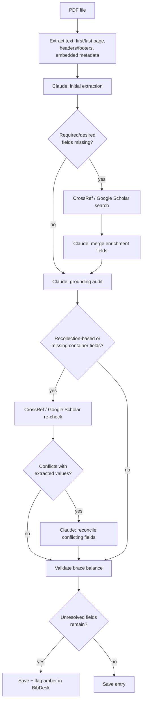
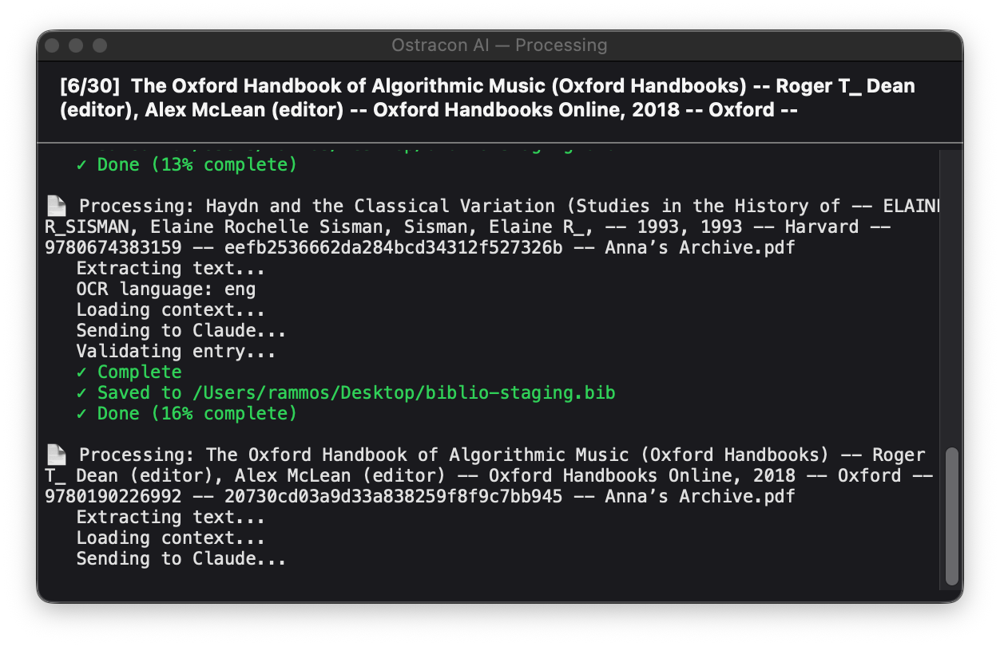

# BibLaTeX-Chicago-Claude (a.k.a. “Ostracon”)

A Claude-powered macOS agent for generating BibLaTeX-Chicago entries from PDF files.

## Quick start

```bash
brew install ocrmypdf                   # OCR support (optional)
pip install -r requirements.txt         # Python dependencies
cp config.yaml.example config.yaml     # then set anthropic_api_key within
cp automator/script.sh.example automator/script.sh  # then edit PYTHON and WORKDIR within
python3 install_service.py              # install the Finder quick action (optional, recommended)
```

Then right-click any PDF in Finder and choose **Extract BibLaTeX-Chicago Bibliography (via Claude)**. See [Setup](#setup) for full configuration details.

## Rationale

[Chicago](https://www.chicagomanualofstyle.org/tools_citationguide/citation-guide-1.html) is the bibliography style typically used in the humanities, cherished for its attention to source and transmission history, to various types of authorship, and to detail in general. Its ”notes and bibliography” variant relies on footnotes or endnotes rather than inline (”author-date”) references, and is the more common one in music theory and musicology.

Given the immense number of types and fields in the [BibLaTeX-Chicago](https://ch.mirrors.cicku.me/ctan/macros/latex/contrib/biblatex-contrib/biblatex-chicago/doc/biblatex-chicago.pdf) package, Zotero is hardly a viable bibliography manager for it, with the otherwise excellent [Better BibTeX](https://retorque.re/zotero-better-bibtex/) extension only alleviating a painful experience. For many writers, [BibDesk](https://bibdesk.sourceforge.io) is the only macOS manager that elegantly navigates the style's ontological complexity. Others avoid managers altogether and prefer to edit `.bib` files directly within a text editor.

With or without BibDesk, this agent enhances BibLaTeX-Chicago writing workflows by providing Zotero-like auto-creation and auto-fill capabilities for new bibliographic materials. Thanks to its reliance on AI—prompted with a mini-corpus of bibliographic examples and a summary of BibLaTeX-Chicago’s specs—the agent should not only match Zotero but actually outperform it in most cases.

Using alternative styles (e.g., APA) would involve only minor modifications to the prompts and context; it is left as a trivial exercise for the reader.

## Functionality

1. Takes one or more PDF files as input.
2. Runs OCR if necessary, after prompting the user to select the text language.
3. Extracts text from the first page (~450 words), the last page (~150 words), running headers/footers from key pages (volume, issue, page range, chapter number), and embedded PDF metadata (title, author, subject, creation date).
4. Sends all of the above to the Claude API with project guidelines and a reference template, and returns a BibLaTeX-Chicago entry.
5. If required or desired fields for the entry type are still missing, searches CrossRef and, as a fallback, Google Scholar (via ScrapingDog) for the work, then merges any fields found via a second Claude call.
6. Audits the entry for fields that may have been filled from Claude's background/training-data recollection rather than the PDF, CrossRef, or Scholar — a real failure mode with academic works Claude may "recognize."
7. For any recollection-based or still-missing container-level fields (editor, series, publisher, location, date), re-checks CrossRef/Scholar and, when their values conflict with what was extracted, reconciles the two via a further Claude call using the project guidelines/template as formatting context. Fields that can't be verified this way are flagged as unresolved.
8. Validates brace balance before saving.
9. Saves the entry — with a BibDesk `bdsk-file` bookmark — either directly into BibDesk (if `autofile_bibdesk` is enabled) or to the staging file (`main_bib_file` in `config.yaml`). Entries with unresolved flagged fields are colored amber in BibDesk for manual review (only possible when `autofile_bibdesk` is enabled).
10. On validation failure, saves the raw entry to `failed_bib_file` and sends a macOS notification.

With `autofile_bibdesk` disabled, the staging file can be periodically imported into BibDesk; PDF links will already be intact thanks to the embedded bookmark.

### Extraction and reconciliation flow


```mermaid
flowchart TD
    A[PDF file] --> B[Extract text: first/last page,<br/>headers/footers, embedded metadata]
    B --> C[Claude: initial extraction]
    C --> D{Required/desired<br/>fields missing?}
    D -- yes --> E[CrossRef / Google Scholar search]
    E --> F[Claude: merge enrichment fields]
    D -- no --> G[Claude: grounding audit]
    F --> G
    G --> H{Recollection-based or<br/>missing container fields?}
    H -- yes --> I[CrossRef / Google Scholar re-check]
    I --> J{Conflicts with<br/>extracted values?}
    J -- yes --> K[Claude: reconcile conflicting fields]
    J -- no --> L[Validate brace balance]
    K --> L
    H -- no --> L
    L --> M{Unresolved fields<br/>remain?}
    M -- yes --> N[Save + flag amber in BibDesk]
    M -- no --> O[Save entry]
```



## Setup

### 1. Install system dependencies

```bash
# OCR support (optional but recommended for scanned PDFs)
brew install ocrmypdf
```

### 2. Create a Python environment and install dependencies

```bash
conda create -n biblio-ai python=3.11   # or use venv
conda activate biblio-ai
pip install -r requirements.txt
```

`requirements.txt` includes:

- `anthropic` — Claude API client.
- `pypdf` — PDF text extraction.
- `pyyaml` — configuration.
- `pyobjc-framework-Cocoa` — macOS file bookmarks for BibDesk integration.

### 3. Configure

Edit `config.yaml`:

```yaml
anthropic_api_key: "sk-ant-..." # your Anthropic API key
main_bib_file: "~/Desktop/biblio-staging.bib" # output file ("staging output")
failed_bib_file: "~/Desktop/biblio-failed.bib" # error file
```

The other paths (`pdf_in_folder`, `pdf_out_folder`, `template_file`, `claude_md_file`) can be left untouched or adjusted to your setup. The optional `ref_file` key (set to `biblatex-chicago-notes-ref.md` by default) loads a condensed biblatex-chicago field reference into the Claude prompt to improve extraction quality; remove or comment it out to omit it.

Set `notifications: true` to enable macOS notifications. When enabled, the agent sends notifications for batch progress updates and validation failures. Defaults to `false`.

### 4. Customize the extraction prompt

Edit `CLAUDE.md` to match your bibliographic conventions. At minimum, review:

- The output format and field exclusions (e.g. which fields to omit).
- Title-case rules for any languages you work with.
- Any domain-specific entry types or fields you rely on.

The richer and more specific your `CLAUDE.md`, the more accurately Claude will format entries to your standards.

### 5. Configure the Automator script

```bash
cp automator/script.sh.example automator/script.sh
```

Edit `automator/script.sh` and set `PYTHON` to the path of your Python executable and `WORKDIR` to the absolute path of this repository. This file is excluded from version control.

### 6. Install the macOS quick action

```bash
python3 install_service.py
```

This builds the Automator workflow from `automator/script.sh` and installs it to `~/Library/Services/`. Re-run it any time you modify `script.sh`.

## Usage

### macOS quick action (recommended)

Right-click any PDF (or selection of PDFs) in Finder and choose **Extract BibLaTeX-Chicago Bibliography (via Claude)**. The entry is appended to the staging file and copied to the clipboard.

See [Setup](#5-configure-the-automator-script) for initial configuration. To reinstall after changes to `automator/script.sh`:

```bash
python3 install_service.py
```

### Command line

```bash
# Process one or more PDFs
python biblio_agent.py path/to/paper.pdf

# Process without saving (print to stdout only)
python biblio_agent.py path/to/paper.pdf --no-save

# Process all PDFs in pdf-in/ and move them to pdf-out/
python biblio_agent.py --all

# Write to a custom output file
python biblio_agent.py path/to/paper.pdf --output custom.bib
```

## Project structure

```
ostracon-ai/
├── biblio_agent.py       # Main orchestrator
├── extract_pages.py      # PDF text extraction with OCR fallback
├── install_service.py    # Builds and installs the macOS Quick Action
├── config.yaml           # Configuration (API key, paths, model)
├── requirements.txt      # Python dependencies
├── CLAUDE.md             # Bibliographic extraction guidelines for Claude
├── biblio-template.bib   # Reference template for BibLaTeX-Chicago types/fields
├── biblatex-chicago-notes-ref.md  # Condensed biblatex-chicago field reference (sent to Claude)
├── automator/
│   ├── script.sh.example # Shell script template (copy to script.sh and edit)
│   └── script.sh         # Your local script (gitignored — machine-specific paths)
├── pdf-in/               # Drop PDFs here for batch processing (--all)
└── pdf-out/              # Processed PDFs are moved here
```

## BibDesk integration

By default the agent writes to the file set in `main_bib_file` (`config.yaml`), which you import into BibDesk manually. Each entry includes a `bdsk-file-1` bookmark so PDF links resolve correctly after import.

Set `autofile_bibdesk: true` in `config.yaml` to skip the staging file entirely. The agent will import each entry directly into BibDesk via AppleScript (opening the staging file in BibDesk if it is not already open) and immediately trigger BibDesk’s auto-file to move the PDF to your papers folder.

## Troubleshooting

**Entry saved to `failed_bib_file` instead of staging file.**

The generated entry had unbalanced braces. Open the failed file, fix the entry manually, and add it to the staging file.

**`bdsk-file-1` bookmark not working after import.**

Make sure `pyobjc-framework-Cocoa` is installed in the Python environment used by the Quick Action (check the `PYTHON` path in `automator/script.sh`).

**Quick Action not appearing in Finder.**

Run `python3 install_service.py` and check System Settings → General → Login Items & Extensions to confirm the action is enabled.

**OCR not working.**

Install `ocrmypdf` via Homebrew. The agent will fall back to direct text extraction if OCR is unavailable. When a scanned PDF is detected, a language selection dialog will appear — pick the language of the document so Tesseract uses the correct model. In quiet/automation mode, the language defaults to `eng`; set `default_ocr_language` in `config.yaml` to override (e.g. `rus`, `deu`, `fra`).

## Cost estimate

Costs are dominated by Claude API calls (`config.yaml`'s `model`, currently `claude-sonnet-4-6` at $3/$15 per 1M input/output tokens). Up to four calls happen per PDF, and the ~9,000 tokens of shared context (`CLAUDE.md` + `biblio-template.bib` + `biblatex-chicago-notes-ref.md`) is sent as a cached prompt prefix (`cache_control: {type: "ephemeral"}`), so only the first call in a run pays full price for it — every later call, including later PDFs in the same batch, reads it back at a 90% discount:

| Call | Runs when | Approx. cost (cache hit) |
|---|---|---|
| Initial extraction | always | ~$0.044 (first PDF in a run) / ~$0.013 (later PDFs, context already cached) |
| Grounding audit | always, if `enrich_missing_fields: true` (default) | ~$0.005 (doesn't use the shared context) |
| Enrichment merge | only if required/desired fields are missing from the PDF | ~$0.007 |
| Reconciliation | only if CrossRef/Scholar data conflicts with the extracted values | ~$0.008 |

- **Best case** (clean, well-populated PDF): extraction + audit ≈ **$0.05/PDF** for the first PDF in a run, **~$0.02/PDF** for subsequent ones.
- **Worst case** (missing fields, needs reconciliation): all four calls ≈ **$0.06/PDF** for the first PDF, **~$0.03/PDF** for subsequent ones.

Since the Finder Quick Action is normally invoked on a multi-PDF selection in a single run (`biblio_agent.py --window --no-move <files...>`), most PDFs in practice land in the cheaper "subsequent" tier — only the very first PDF pays the full cache-write price. External API costs are negligible on top of this: CrossRef is free; the Google Scholar fallback (ScrapingDog) runs at roughly $0.0004/credit on the pay-as-you-go plan ($10 for 25,000 credits), and each lookup uses only a couple of credits.

These figures are higher than the pipeline's original ~$0.02–$0.03/PDF estimate, reflecting the enrichment/audit/reconciliation calls added since — though caching claws back most of that increase for anything beyond the first PDF in a batch.

## “Ostracon”?

> An ostracon (Greek: ὄστρακον  /ós.tra.kon/, plural ὄστρακα  /ós.tra.ka/) is a piece of pottery (or stone), usually broken off from a vase or other earthenware vessel. In archaeology, ostraca may contain scratched-in words or other forms of writing which may give clues as to the time when the piece was in use.

## License

Copyright (c) 2026 [yrammos](https://github.com/yrammos). Licensed under [CC BY-NC 4.0](https://creativecommons.org/licenses/by-nc/4.0/). Free for personal use; attribution requested for forks and modifications; commercial use prohibited.
