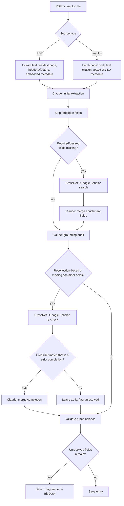

# BibLaTeX-Chicago-Claude (a.k.a. “Ostracon”)

A Claude-powered macOS agent for generating BibLaTeX-Chicago entries from PDF files and `.webloc` bookmarks to online-only publications.

## Quick Start

```bash
brew install ocrmypdf                   # OCR support (optional)
pip install -r requirements.txt         # Python dependencies
cp config.yaml.example config.yaml     # then set anthropic_api_key within
cp automator/script.sh.example automator/script.sh  # then edit PYTHON and WORKDIR within
python3 install_service.py              # install the Finder quick action (optional, recommended)
```

Then right-click any PDF or `.webloc` file in Finder and choose **Extract BibLaTeX-Chicago Bibliography (via Claude)**. See [Setup](#setup) for full configuration details.

## Rationale

[Chicago](https://www.chicagomanualofstyle.org/tools_citationguide/citation-guide-1.html) is the bibliography style typically used in the humanities, cherished for its attention to source and transmission history, to various types of authorship, and to detail in general. Its "notes and bibliography" variant relies on footnotes or endnotes rather than inline ("author-date") references, and is the more common one in music theory and musicology.

The immense number of types and fields in the [BibLaTeX-Chicago](https://ch.mirrors.cicku.me/ctan/macros/latex/contrib/biblatex-contrib/biblatex-chicago/doc/biblatex-chicago.pdf) package makes Zotero unsustainable as a bibliography manager, with the otherwise excellent [Better BibTeX](https://retorque.re/zotero-better-bibtex/) extension only alleviating a painful experience. For many writers, [BibDesk](https://bibdesk.sourceforge.io) is the only macOS manager that elegantly navigates the style's ontological complexity. Others avoid managers altogether and prefer to edit `.bib` files directly within a text editor.

With or without BibDesk, this agent enhances BibLaTeX-Chicago writing workflows by providing Zotero-like auto-creation and auto-fill capabilities for new bibliographic materials, whether in the form of PDF files or `.webloc` links. Thanks to its reliance on AI and elaborate prompting, the agent should not only match Zotero but actually outperform it in most cases.

Using alternative styles (e.g., APA) would involve only minor modifications to the prompts and context; it is left as a trivial exercise for the reader.

## Functionality

1. Takes one or more PDF and/or `.webloc` files as input.
2. For a PDF: runs OCR if necessary, after prompting the user to select the text language, then extracts text from the first page (~450 words), the last page (~150 words), running headers/footers from key pages (volume, issue, page range, chapter number), and embedded PDF metadata (title, author, subject, creation date). For a `.webloc` file: resolves the bookmarked URL, fetches the page, and extracts its main body text along with `citation_*`/`og:*`/JSON-LD metadata—the online equivalent of a PDF's embedded metadata.
3. Sends all of the above to the Claude API together with the cached context prefix — the house-style guidelines, the entry-type template, the field reference, and the worked-example corpora — and returns a BibLaTeX-Chicago entry. An entry sourced from a `.webloc` is given its `Url`/`Urldate`, since there is no PDF to file as the entry's locator instead.
4. Strips any field the guidelines forbid (ISSN, keywords, or `Url`/`Urldate` on an entry that is neither `@Online` nor undated) that Claude included anyway. A structural safeguard, because the prompt instruction alone isn't followed reliably.
5. If required or desired fields for the entry type are still missing, searches CrossRef and, as a fallback, Google Scholar (via ScrapingDog) for the work, then merges any fields found via a second Claude call.
6. Audits the entry for fields filled from Claude's training-data recollection rather than the source text—a genuine failure mode with academic works Claude may recognize.
7. Re-checks CrossRef/Scholar for recollection-based or missing container-level fields (editor, publisher, date). A conflicting value is applied automatically only when it comes from CrossRef *and* strictly completes the claimed value—spelling out an initial, adding a missing co-author—never a contradiction, and never from Scholar's fuzzier match. Anything else is flagged for review rather than overwritten: a wrong field is worse than an empty one.
8. Validates brace balance before saving.
9. Saves the entry—with a BibDesk `bdsk-file` bookmark to the source PDF or `.webloc` file—either directly into BibDesk (if `autofile_bibdesk` is enabled) or to the staging file (`main_bib_file` in `config.yaml`). Entries with unresolved flagged fields are colored amber in BibDesk for manual review (only possible when `autofile_bibdesk` is enabled).
10. On validation failure, saves the raw entry to `failed_bib_file` and sends a macOS notification.

With `autofile_bibdesk` disabled, the staging file can be periodically imported into BibDesk; source links will already be intact thanks to the embedded bookmark.

### Extraction and Reconciliation Flow


```mermaid
flowchart TD
    A[PDF or .webloc file] --> B{Source type}
    B -- PDF --> C1[Extract text: first/last page,<br/>headers/footers, embedded metadata]
    B -- .webloc --> C2[Fetch page: body text,<br/>citation_/og/JSON-LD metadata]
    C1 --> D[Claude: initial extraction]
    C2 --> D
    D --> E[Strip forbidden fields]
    E --> F{Required/desired<br/>fields missing?}
    F -- yes --> G[CrossRef / Google Scholar search]
    G --> H[Claude: merge enrichment fields]
    F -- no --> I[Claude: grounding audit]
    H --> I
    I --> J{Recollection-based or<br/>missing container fields?}
    J -- yes --> K[CrossRef / Google Scholar re-check]
    K --> L{CrossRef match that is a<br/>strict completion?}
    L -- yes --> M[Claude: merge completion]
    L -- no --> N[Leave as-is, flag unresolved]
    M --> O[Validate brace balance]
    N --> O
    J -- no --> O
    O --> P{Unresolved fields<br/>remain?}
    P -- yes --> Q[Save + flag amber in BibDesk]
    P -- no --> R[Save entry]
```


## Setup

### 1. Install System Dependencies

```bash
# OCR support (optional but recommended for scanned PDFs)
brew install ocrmypdf
```

### 2. Create a Python Environment and Install Dependencies

```bash
conda create -n biblio-ai python=3.11   # or use venv
conda activate biblio-ai
pip install -r requirements.txt
```

`requirements.txt` includes:

- `anthropic`—Claude API client.
- `pypdf`—PDF text extraction.
- `pyyaml`—configuration.
- `pyobjc-framework-Cocoa`—macOS file bookmarks for BibDesk integration.
- `requests`—fetching `.webloc`-bookmarked pages.
- `beautifulsoup4`—parsing fetched pages for text and metadata.

### 3. Configure

Edit `config.yaml`:

```yaml
anthropic_api_key: "sk-ant-..." # your Anthropic API key
main_bib_file: "~/Desktop/biblio-staging.bib" # output file ("staging output")
failed_bib_file: "~/Desktop/biblio-failed.bib" # error file
```

The other paths (`pdf_in_folder`, `pdf_out_folder`, `template_file`, `claude_md_file`) can be left untouched or adjusted to your setup. The optional `ref_file` key (set to `biblatex-chicago-notes-ref.md` by default) loads a condensed biblatex-chicago field reference into the Claude prompt to improve extraction quality; remove or comment it out to omit it.

The optional `example_files` key loads two worked-example corpora from the biblatex-chicago package's own documentation:

- `notes-test.bib` — the package's annotated test suite (203 entries, 32 of the ~40 entry types), where nearly every entry's `annote` explains *why* that type and those fields were chosen. Converted to this project's conventions: Unicode accents rather than LaTeX macros, single-hyphen ranges.
- `cms-notes-intro-guide.md` — prose grouping entry types by kind of source, derived from `cms-notes-intro.tex` by `extract_intro.py`. Bracketed names point at examples in `notes-test.bib`.

Where the field reference teaches *vocabulary* (which fields a type takes), these teach *classification* — what kind of thing a source is, and which type therefore fits. They add ~49,000 tokens to the cached prefix; see [Cost Estimate](#cost-estimate) before enabling them on single-file runs.

Precedence splits by question, not by file: the corpora are authoritative on what biblatex-chicago supports, `CLAUDE.md` and `biblio-template.bib` on this project's presentation choices. Neither local file is an allowlist — `biblio-template.bib` covers 20 types, `notes-test.bib` 32, and types absent from both (`@Letter`, `@CustomC`, `@Audio`, the `@Mv*` and legal types) remain available.

#### External lookup services (optional)

When a source doesn't yield every field the entry type needs, the agent queries external catalogues. Both keys are optional and the pipeline runs without them — it simply flags what it couldn't fill.

```yaml
crossref_email: "you@example.com"  # optional; enables CrossRef's faster "polite pool"
scrapingdog_api_key: ""            # optional; enables the Google Scholar fallback
```

- **CrossRef** is free and needs no account. Supplying `crossref_email` opts you into the [polite pool](https://api.crossref.org), which is faster and more reliable than the anonymous one; the address is sent as a courtesy identifier, nothing more. Leave it blank to stay anonymous.
- **Google Scholar** has no public API, so the fallback goes through [ScrapingDog](https://scrapingdog.com), which is paid — roughly $0.0004/credit on pay-as-you-go ($10 for 25,000 credits), a couple of credits per lookup. Leave `scrapingdog_api_key` empty to disable it: CrossRef alone resolves most journal articles, and Scholar is only consulted for what CrossRef missed. Its results are also trusted less — a Scholar-sourced value is never auto-applied over a conflicting one, only ever flagged for review.

#### Other options

| Key | Default | Effect |
|---|---|---|
| `model` | `claude-sonnet-4-6` | Claude model. Run `estimate_cost.py --model <id>` to price alternatives first. |
| `max_tokens` | `4000` | Ceiling on each response. Entries run 400–500 tokens; the headroom absorbs longer ones. |
| `cache_ttl` | `"1h"` | Prompt-cache lifetime. See [Cost Estimate](#cost-estimate). |
| `enrich_missing_fields` | `true` | Enables the CrossRef/Scholar lookups, the grounding audit, and reconciliation. Setting it `false` leaves only the initial extraction — cheaper and faster, but nothing verifies the result. |
| `verbose` | `true` | Progress messages on stderr. |
| `show_window` | `false` | Show the floating progress window by default (`--window`/`--no-window` override it). |
| `window_models` | sonnet-4-6, opus-5 | Models offered in the progress window's dropdown — see [Quick Action](#macos-quick-action-recommended). Unset hides the dropdown. |
| `window_start_delay` | `4` | Seconds the window waits before the first file so the model can be changed; `0` starts immediately. |
| `notifications` | `false` | macOS notifications for batch progress and validation failures. |
| `ocr_threshold` | `100` | Words below which a PDF is treated as scanned and sent to OCR. |
| `ocr_timeout` | `180` | Seconds allowed for `ocrmypdf` before giving up. |
| `default_ocr_language` | `eng` | Tesseract language used when OCR runs non-interactively. |


### 4. Customize the Extraction Prompt

Edit `CLAUDE.md` to match your bibliographic conventions. At minimum, review:

- The output format and field exclusions (e.g. which fields to omit), including the `@Online`/undated-entry exception that allows `Url`/`Urldate`.
- Title-case rules for any languages you work with.
- Any domain-specific entry types or fields you rely on.

The richer and more specific your `CLAUDE.md`, the more accurately Claude will format entries to your standards.

### 5. Configure the Automator Script

```bash
cp automator/script.sh.example automator/script.sh
```

Edit `automator/script.sh` and set `PYTHON` to the path of your Python executable and `WORKDIR` to the absolute path of this repository. This file is excluded from version control.

### 6. Install the macOS Quick Action

```bash
python3 install_service.py
```

This builds the Automator workflow from `automator/script.sh` and installs it to `~/Library/Services/`, accepting both PDFs and `.webloc` files. Re-run it any time you modify `script.sh`.

### 7. Verify the setup

```bash
python3 test_setup.py
```

Checks dependencies, `config.yaml`, the context files, OCR availability, and — since both drifted twice while this was being built — that `README.md` still names every config key, every CLI flag, and every tracked root file. Re-run it after adding a setting or a flag; it fails loudly rather than leaving the documentation quietly stale.

The Quick Action runs `test_setup.py --preflight` before each batch — a fast subset covering dependencies, config, and the context files. It is silent when everything is in order, and aborts with an alert naming the problem when it isn't, rather than letting a broken environment surface as a Python traceback after the progress window has opened. OCR, the input folder, and the documentation audit are skipped there, being either non-blocking or a developer concern.

## Usage

### macOS Quick Action (Recommended)

Right-click any PDF or `.webloc` file (or a mixed selection of both) in Finder and choose **Extract BibLaTeX-Chicago Bibliography (via Claude)**. The entry is appended to the staging file and copied to the clipboard.

See [Setup](#5-configure-the-automator-script) for initial configuration. To reinstall after changes to `automator/script.sh`:

```bash
python3 install_service.py
```

The progress window carries a **Model** dropdown listing whatever `window_models` names in `config.yaml`. It holds for `window_start_delay` seconds (4 by default) before the first file, showing a countdown, so a batch you already know needs a stronger model can get one from the start; the run begins on its own when the count expires, so an unattended batch is never left waiting. Set the delay to `0` to start immediately. Changing the dropdown later applies from the next file in the batch, so if an entry comes out wrong you can switch and let the remainder run on a stronger model — the Quick Action's equivalent of `--model`, since there's no command line on that path. Switching costs little: prompt caches are per-model and coexist, so a run that alternates pays one cache write per model rather than one per switch.

Reference works (Grove, the Stanford Encyclopedia, Wikipedia) are where the stronger model earns its keep — see the operator note in `CLAUDE.md`.

### Command Line

```bash
# Process one or more PDFs and/or .webloc files
python biblio_agent.py path/to/paper.pdf path/to/bookmark.webloc

# Process without saving (print to stdout only)
python biblio_agent.py path/to/paper.pdf --no-save

# Process all PDFs and .webloc files in pdf-in/ and move them to pdf-out/
python biblio_agent.py --all

# Write to a custom output file
python biblio_agent.py path/to/paper.pdf --output custom.bib

# Use a different model for one run (overrides config.yaml)
python biblio_agent.py path/to/entry.webloc --model claude-opus-5
```

All flags:

| Flag | Effect |
|---|---|
| `--all` | Process everything in `pdf_in_folder` instead of named files. |
| `--no-save` | Print to stdout only — no staging file, no BibDesk import. |
| `--no-move` | Leave processed files where they are (the Quick Action uses this, since your sources aren't in `pdf-in/`). |
| `--output FILE` | Write to `FILE` instead of `main_bib_file`. |
| `--model ID` | Use a different model for this run. |
| `--config FILE` | Use an alternate config file. |
| `--window` / `--no-window` | Force the progress window on or off, overriding `show_window`. |
| `-q`, `--quiet` | Suppress status messages (sets `verbose: false`). |

Relative paths in `config.yaml` resolve against the repository, not the working directory, so these commands work from anywhere. A context file named in `config.yaml` but missing from disk is an error rather than a warning: every one of them forms part of the cached prompt prefix, and running without them would quietly degrade extraction instead of failing.

## Project Structure

```
ostracon-ai/
├── biblio_agent.py       # Main orchestrator
├── extract_pages.py      # PDF text extraction with OCR fallback; the shared SourceContent shape
├── web_source.py         # Fetches and extracts bibliographic content from a .webloc's bookmarked page
├── enrich.py             # CrossRef/Google Scholar enrichment and reconciliation, BibTeX field utilities
├── progress_window.py    # Native macOS floating progress window (--window)
├── install_service.py    # Builds and installs the macOS Quick Action
├── estimate_cost.py      # Measures the current prompt-cache cost profile
├── extract_intro.py      # Regenerates cms-notes-intro-guide.md from the upstream .tex
├── test_setup.py         # Checks dependencies, config, and API connectivity
├── config.yaml.example   # Configuration template (copy to config.yaml)
├── config.yaml           # Your configuration (gitignored — contains the API key)
├── requirements.txt      # Python dependencies
│
│   # Sent to Claude as the cached prompt prefix:
├── CLAUDE.md             # Bibliographic extraction guidelines — the house style
├── biblio-template.bib   # One worked example per entry type, in this project's conventions
├── biblatex-chicago-notes-ref.md  # Condensed biblatex-chicago field and entry-type reference
├── notes-test.bib        # The package's annotated test suite (203 entries) — see Third-party material
├── cms-notes-intro-guide.md       # Entry-type guide derived from cms-notes-intro.tex
├── cms-notes-intro.tex   # Upstream source for the guide above (not sent to Claude)
│
├── automator/
│   ├── script.sh.example # Shell script template (copy to script.sh and edit)
│   └── script.sh         # Your local script (gitignored — machine-specific paths)
├── pdf-in/               # Drop PDFs and .webloc files here for batch processing (--all)
└── pdf-out/              # Processed PDFs are moved here (webloc files are typically relocated by BibDesk instead—see below)
```

## BibDesk Integration

By default the agent writes to the file set in `main_bib_file` (`config.yaml`), which you import into BibDesk manually. Each entry includes a `bdsk-file-1` bookmark to the source PDF or `.webloc` file so it resolves correctly after import.

Set `autofile_bibdesk: true` in `config.yaml` to skip the staging file entirely. The agent will import each entry directly into BibDesk via AppleScript (opening the staging file in BibDesk if it is not already open) and immediately trigger BibDesk's auto-file to move the source file to your papers folder. When this happens, the agent's own move to `pdf_out_folder` is skipped for that file, since BibDesk has already relocated it.

## Troubleshooting

**Entry saved to `failed_bib_file` instead of staging file.**

The generated entry had unbalanced braces. Open the failed file, fix the entry manually, and add it to the staging file.

**Entry colored amber/orange in BibDesk.**

A field couldn't be safely confirmed: either the grounding audit flagged it as possibly drawn from Claude's background knowledge and no CrossRef/Scholar match resolved it, or a Scholar match (or a CrossRef match that wasn't a clear completion of the claimed value) came back conflicting. Rather than risk a silent, wrong override, the field is left as extracted and the entry is flagged for you to check by hand.

**`bdsk-file-1` bookmark not working after import.**

Make sure `pyobjc-framework-Cocoa` is installed in the Python environment used by the Quick Action (check the `PYTHON` path in `automator/script.sh`).

**Quick Action not appearing in Finder.**

Run `python3 install_service.py` and check System Settings → General → Login Items & Extensions to confirm the action is enabled.

**Startup fails with "Context files configured in config.yaml are missing".**

A file named in `claude_md_file`, `template_file`, `ref_file`, or `example_files` isn't where the config says it is. These form the cached prompt prefix, so the agent refuses to start rather than run without them and produce quietly worse entries. Fix the path, restore the file, or remove the key to run deliberately without it. Relative paths resolve against the repository, not your working directory.

**OCR not working.**

Install `ocrmypdf` via Homebrew. The agent will fall back to direct text extraction if OCR is unavailable. When a scanned PDF is detected, a language selection dialog will appear—pick the language of the document so Tesseract uses the correct model. In quiet/automation mode, the language defaults to `eng`; set `default_ocr_language` in `config.yaml` to override (e.g. `rus`, `deu`, `fra`). `.webloc` sources never need OCR, since their text comes from the fetched page rather than a scanned image.

## Cost Estimate

Claude API calls dominate. At `claude-sonnet-4-6` rates ($3/$15 per 1M input/output tokens), cache writes cost 1.25× input at the default five-minute TTL, 2× at one hour, and cache reads 0.1×.

The static prefix measures **61,879 tokens** (209,015 chars). Writing it costs $0.23; every later call in the same run reads it back for $0.019.

| Call | Runs when | First file | Later files |
|---|---|---|---|
| Extraction | always | $0.25 | $0.03 |
| Grounding audit | `enrich_missing_fields: true` (default) | $0.005 | $0.005 |
| Enrichment merge | required/desired fields missing | $0.03 | $0.03 |
| Reconciliation | a CrossRef match strictly completes a value | $0.03 | $0.03 |

A clean source costs **~$0.25 for the first file in a run and ~$0.04 for each one after**; if all four calls fire, **~$0.30 and ~$0.09**.

Reconciliation is conservative — a Scholar-sourced conflict, or a CrossRef value that contradicts rather than completes, is flagged for review without reaching that fourth call — so the worst case is rarer than the table suggests. Three of the four calls use the cached prefix; the grounding audit does not.

### Batching and cache TTL

The prefix is written once per run and read thereafter, so cost turns on how often a run starts without a warm cache. At the default five-minute TTL the cache does not survive between separate Quick Action invocations:

| Usage pattern | 5-minute TTL | 1-hour TTL |
|---|---|---|
| One batch of 10, nothing else that hour | $0.60 | $0.74 |
| Two batches of 5, 20 minutes apart | $0.81 | $0.74 |
| 10 single-file invocations across an hour | $2.52 | $0.74 |

The one-hour TTL costs a flat **$0.14 more per cache write** and nothing more per file, so it loses only when a run is genuinely isolated. Any second run within the hour — batch or single — repays it, which is why `cache_ttl` defaults to `"1h"`; set it to `"5m"` in `config.yaml` if you always process files in one large batch.

To cut the prefix instead: dropping `notes-test.bib` from `example_files` while keeping `cms-notes-intro-guide.md` leaves ~15,500 tokens and a ~$0.08 first file — retaining the entry-type taxonomy while losing the 203 annotated examples. Commenting out `example_files` entirely leaves ~12,800 tokens and ~$0.07; most of the prefix is `notes-test.bib`, so dropping the guide as well saves little.

These figures are produced by `estimate_cost.py`, which measures the real assembled prompt with `count_tokens` rather than restating hardcoded numbers. Re-run it (`python3 estimate_cost.py --markdown`) after changing the context files, the prompt, or the model; `--model` prices a different one.

External APIs are negligible: CrossRef is free, and the ScrapingDog fallback runs about $0.0004/credit at a couple of credits per lookup.

## "Ostracon"?

> An ostracon (Greek: ὄστρακον  /ós.tra.kon/, plural ὄστρακα  /ós.tra.ka/) is a piece of pottery (or stone), usually broken off from a vase or other earthenware vessel. In archaeology, ostraca may contain scratched-in words or other forms of writing which may give clues as to the time when the piece was in use.

## License

Copyright (c) 2026 [yrammos](https://github.com/yrammos). Licensed under [CC BY-NC 4.0](https://creativecommons.org/licenses/by-nc/4.0/). Free for personal use; attribution requested for forks and modifications; commercial use prohibited.

### Third-party material

Three files are drawn from the [biblatex-chicago](https://ctan.org/pkg/biblatex-chicago) package (v2.3b, 2024-04-15), Copyright © 2008–2024 David Fussner, distributed under the [LaTeX Project Public License v1.3](https://www.latex-project.org/lppl/). They are redistributed here under that licence, not under this project's CC BY-NC terms:

| File | Origin | Modified |
|---|---|---|
| `cms-notes-intro.tex` | package `doc/` directory | no |
| `notes-test.bib` | package `doc/` directory | yes — LaTeX accent macros converted to Unicode, double-hyphen ranges converted to single hyphens; no bibliographic content altered |
| `cms-notes-intro-guide.md` | derived from `cms-notes-intro.tex` by `extract_intro.py` | yes — LaTeX scaffolding stripped, cross-references rendered as plain text; wording unchanged |

Each file records its own provenance and modifications in a header, as the LPPL requires. `extract_intro.py` is included so the derivation can be reproduced or re-run against a newer upstream release.
